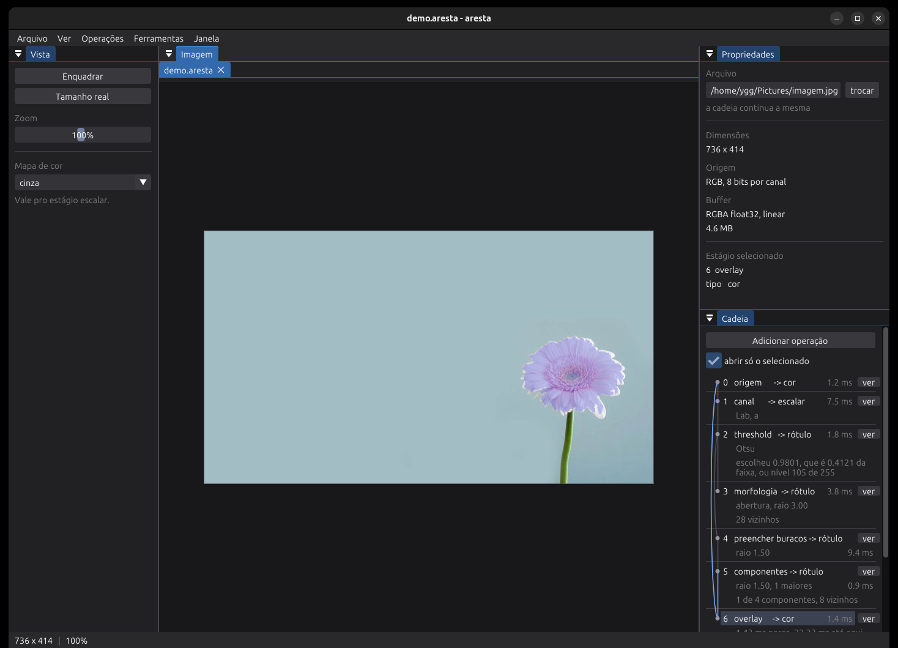
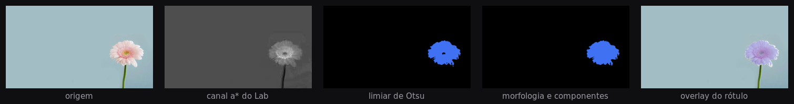
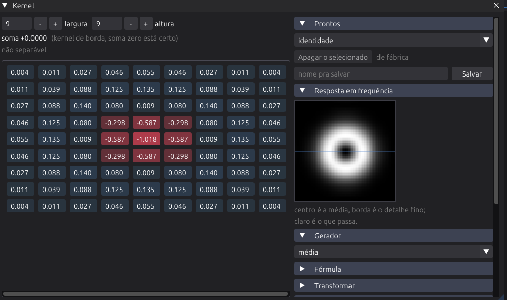
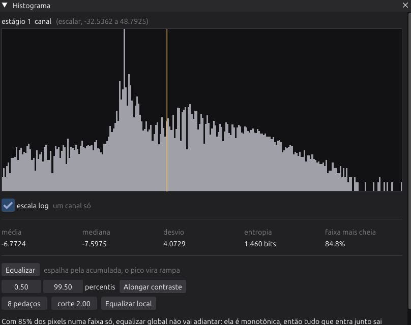

# aresta

Bancada de processamento de imagem em C++, escrita do zero, para estudo e
experimentação de algoritmos. Reúne o processamento clássico do livro do
Gonzalez e os algoritmos de segmentação por grafo, IFT e OIFT.



A unidade de trabalho é a **cadeia**: uma lista ordenada de operações onde a
saída de cada estágio fica guardada, inspecionável e cronometrada. Mudar um
parâmetro reavalia a cadeia inteira e mostra o efeito em qualquer ponto dela,
não só no fim.

## Exemplo

Segmentar a flor, cinco estágios:



O canal `a*` do Lab separa magenta de verde num escalar só, o que deixa o
histograma bimodal e o Otsu decide sozinho. A abertura come o respingo, o
preenchimento fecha o miolo escuro, e o filtro de componentes fica com a maior.

Essa cadeia é o arquivo abaixo, e o programa lê e escreve ele:

```
aresta 1
imagem /home/ygg/Pictures/imagem.jpg
vista 6

estagio 1 canal
  de 0
  ativo 1
  espaco lab
  componente 1

estagio 2 limiar
  de 1
  ativo 1
  nivel 0.5
  otsu 1
  unidade fracao
  bits 8
```

## Núcleo

Cor é `float32` em espaço **linear**, RGBA intercalado, com stride pra recorte
sair sem cópia. A conversão de sRGB acontece só nas bordas, na leitura e na ida
pra tela. `Map<T>` é o plano escalar de mesma geometria, um valor por pixel.

Um estágio produz um de três tipos, e é isso que define o que pode ser ligado
em quê:

| tipo | representação | onde aparece |
| --- | --- | --- |
| cor | `Image`, RGBA float32 linear | imagem, composição, overlay |
| escalar | `Map<float>` | gradiente, distância, canal, espectro |
| rótulo | `Map<int32_t>` | binário, componentes, bacias, sementes |

A cadeia é tipada e recusa ligação inválida antes de rodar. Operação
polimórfica (`morfologia`, `girar`, `combinar`) declara o conjunto que aceita e
devolve o que recebeu: morfologia sobre rótulo sai rótulo, sobre escalar sai
escalar. Convolução não entra em rótulo, porque interpolar índice de região não
quer dizer nada.

As ligações são por id, não por posição, então apagar um estágio do meio não
reescreve a referência de todo mundo que vem depois. Reordenar é recusado
quando a troca faria alguém depender de quem vem depois.

## Operações

| grupo | operações |
| --- | --- |
| Tom | exposição, contraste, gama, inverter, curva por fórmula, plano de bit |
| Histograma | equalizar, CLAHE, alongar contraste, casar histograma |
| Vizinhança | convolução, médias (aritmética, geométrica, harmônica, contra-harmônica), filtro de ordem (mediana, mín, máx, ponto médio, alfa-cortada), redução adaptativa, mediana adaptativa |
| Frequência | espectro, filtros ideal/Butterworth/gaussiano em passa-baixa, passa-alta, passa-faixa e rejeita-faixa, degradação por movimento e turbulência, filtro inverso, Wiener e mínimos quadrados restritos |
| Cor | canal em RGB, HSV, HSI, Lab, YCbCr e CMY, composição, gradiente vetorial, distância a uma cor, pseudo-cor |
| Binário | limiar (absoluto, fração ou nível, com Otsu), limiar local (média, gaussiana, Sauvola), multi-Otsu, Canny, zero-crossings do LoG, Hough para retas e círculos, watershed por marcadores, morfologia, hit-or-miss, afinamento, preencher buracos, reconstrução geodésica, componentes conexas, transformada de distância |
| Geometria | redimensionar, girar, recortar, espelhar, quantizar |
| Entre estágios | combinar (soma, subtração, diferença absoluta, produto, divisão, mín, máx, média), overlay, ruído |

Ruído tem gaussiano, rayleigh, gama, exponencial, uniforme, sal e pimenta e
periódico, com semente fixa pra experimento repetir.

A transformada de distância aceita euclidiana exata (Felzenszwalb e
Huttenlocher, separável) ou chanfro em D4 e D8.

## Convolução



`Ferramentas > Kernel` edita a matriz coeficiente a coeficiente, carrega um dos
prontos, gera por parâmetro (média, gaussiana, LoG, diferença de gaussianas,
Gabor, disco, borrado de movimento, constante) ou preenche por fórmula, onde `x` e `y` contam do
centro, `r` e `t` são as mesmas coordenadas em polar, e `a`, `b`, `c` ficam em
sliders. `gauss(r, a)` reconstrói a gaussiana, `r <= a` dá um disco.

A janela mostra a soma dos coeficientes, se a matriz é separável (a diferença
entre `w*h` e `w+h` multiplicações por pixel) e a resposta em frequência ao
vivo. Na captura acima, o LoG e o anel passa-faixa que ele é.

O botão `editar` na linha do estágio liga a janela naquele estágio, e daí em
diante mexer num coeficiente é mexer na cadeia. A janela da curva funciona
igual.

Borda em zero, estender, espelhar ou circular. O caminho é escolhido por
tamanho de kernel, e dá pra forçar:

| kernel | espacial | frequência |
| --- | --- | --- |
| 5x5 | 1.1 ms | 14.8 ms |
| 11x11 | 5.4 ms | 13.4 ms |
| 21x21 | 13.4 ms | 13.7 ms |
| 41x41 | 46.3 ms | 15.0 ms |
| 81x81 | 169.1 ms | 14.0 ms |

Medido em 736x414. O custo da FFT não cresce com o kernel, então o corte
automático fica em 25x25.

## Histograma



`Ferramentas > Histograma` mede o estágio que está na tela, não a imagem
original. Em cor mostra R, G, B e luminância, com as faixas contadas em sRGB ou
no valor linear guardado. Escala log por padrão, porque um fundo liso vira um
pico que achata todo o resto contra o eixo.

Junto vêm média, mediana, desvio, entropia e o peso da faixa mais cheia, o
nível do Otsu marcado na curva, e botões que acrescentam estágio na cadeia.

Quando a faixa mais cheia passa de metade dos pixels, a janela avisa: a
equalização global é monotônica, então tudo que entrou junto sai junto. Com 85%
dos pixels numa faixa só, como no `a*` da captura, nenhuma função de um
argumento espalha aquilo. A local escapa disso dando mapeamentos diferentes em
lugares diferentes. O estágio `equalizar` faz o mesmo aviso a partir de um
quarto.

## Curva

`Ferramentas > Curva` é a família de transformação de intensidade: negativo,
log, gama, alongamento linear, fatiamento, solarização. Todas saem da mesma
fórmula em `v`, com o gráfico desenhado por cima do histograma da entrada.

Isso não cabe num kernel: convolução é linear, então multiplica e soma, mas não
eleva a potência nem corta faixa.

## Projeto

`Ctrl+S` salva um `.aresta`: a cadeia inteira, o caminho da imagem e o estado
da vista. É texto, uma linha por campo, pra dar pra ler num editor e comparar
duas versões no diff.

As chaves são sem acento, porque vivem no arquivo e não mudam junto com o texto
da interface. As enumerações vão por extenso (`borda zero`, não `borda 0`),
senão inserir um valor no meio de um `enum` quebraria projeto antigo em
silêncio. Campo ausente fica no padrão, então projeto velho continua abrindo
depois que uma operação ganha parâmetro.

Se a imagem não estiver mais no lugar, o projeto abre do mesmo jeito e o
programa pergunta qual imagem anexar. A cadeia é o trabalho; o arquivo de
entrada é só onde ela apontava.

Vários arquivos abrem ao mesmo tempo, em abas, cada um com sua imagem, sua
cadeia e seu projeto. `trocar` em propriedades roda a mesma cadeia noutra
imagem, que é o jeito de comparar duas entradas no mesmo pipeline.
`./aresta projeto.aresta outra.png` faz isso direto da linha de comando.

## Exportar

`Arquivo > Exportar como` (Ctrl+E) pergunta qual estágio salvar, não só o que
está na tela, e se você quer **como aparece** (RGBA de 8 bits, com colormap,
pra figura) ou os **valores crus** (o número que o estágio carrega, sem
colormap e sem cortar).

| formato | guarda |
| --- | --- |
| PNG, JPEG, BMP, TGA | o que aparece |
| PFM | float32 exato |
| Netpbm | PGM de 16 bits |
| CSV | nove dígitos |
| NPY | abre no `numpy.load` |

## Build

Precisa de um compilador com C++20, CMake, Ninja e SDL2:

```bash
sudo apt install build-essential cmake ninja-build libsdl2-dev libgl-dev
./build.sh Release
./aresta imagem.png
```

`./build.sh` sem argumento faz Debug. O script deixa um link simbólico `aresta`
na raiz apontando pro binário em `build/bin`.

Arquivo entra por argumento, arrastado na janela ou pelo menu. Arrastar em cima
de algo já aberto abre outra aba.

## Stack

C++20 no núcleo, SDL2 pra janela e input, Dear ImGui pra interface, OpenGL 3.3
pra desenhar, stb_image pra ler arquivo. CMake e Ninja no build.

## Estado

Feito:

- [x] buffer float32 linear, `Map<T>`, operações por pixel
- [x] cadeia tipada, com a saída de cada estágio inspecionável e cronometrada
- [x] convolução, com editor de kernel, geradores, fórmula e caminho por FFT
- [x] transformação de intensidade por fórmula, com o gráfico da curva
- [x] histograma, equalização global e local, alongamento e Otsu
- [x] filtros de ordem, casamento de histograma, planos de bit
- [x] FFT 2D, espectro centralizado e filtros no domínio da frequência
- [x] modelos de ruído com semente fixa, filtros de média e adaptativos
- [x] degradação, filtro inverso, Wiener e mínimos quadrados restritos
- [x] HSV, HSI, Lab, YCbCr e CMY, gradiente de cor e pseudo-cor
- [x] vizinhança por raio, morfologia e componentes, com filtro por área
- [x] distância exata e por chanfro, reconstrução geodésica, esqueleto,
      hit-or-miss
- [x] Canny, zero-crossings do LoG, limiar local e multi-Otsu
- [x] Hough para retas e círculos, e watershed por marcadores
- [x] redimensionar, girar, recortar, espelhar e quantizar, com interpolação
- [x] aritmética entre estágios, fios da cadeia desenhados, exibição fixável
- [x] mapa escalar e de rótulo na tela, com colormap
- [x] exportar estágio: PNG, JPEG, BMP, TGA, Netpbm, PFM, CSV, NPY
- [x] salvar e carregar projeto, com vários abertos em abas

Falta:

- [ ] métricas de erro (PSNR, SSIM), descritores de região, wavelets
- [ ] pincel de semente, IFT e OIFT sobre a imagem
- [ ] bancada de grafo: montar, desenhar, rodar algoritmo e exportar
- [ ] modo bench: rodar sobre dataset, cronometrar, medir

Desenvolvido no Ubuntu 24.04.
