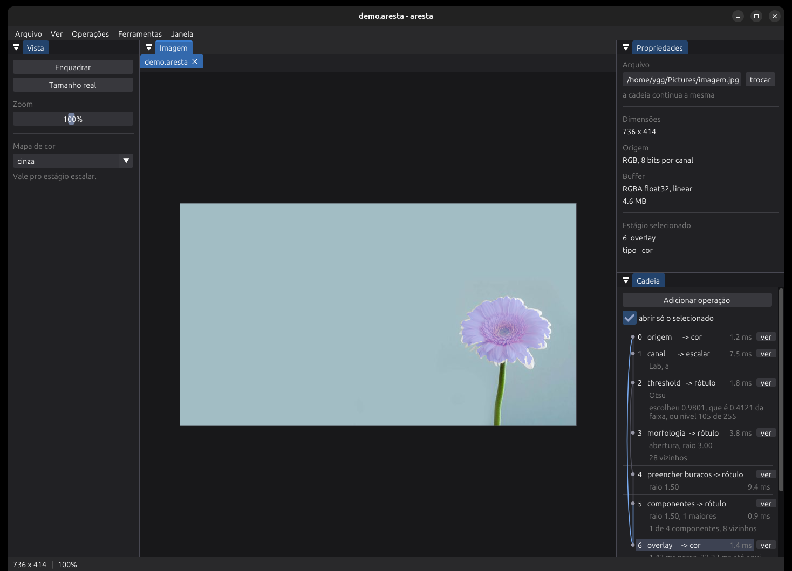
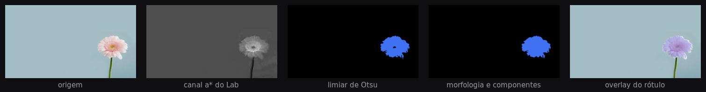
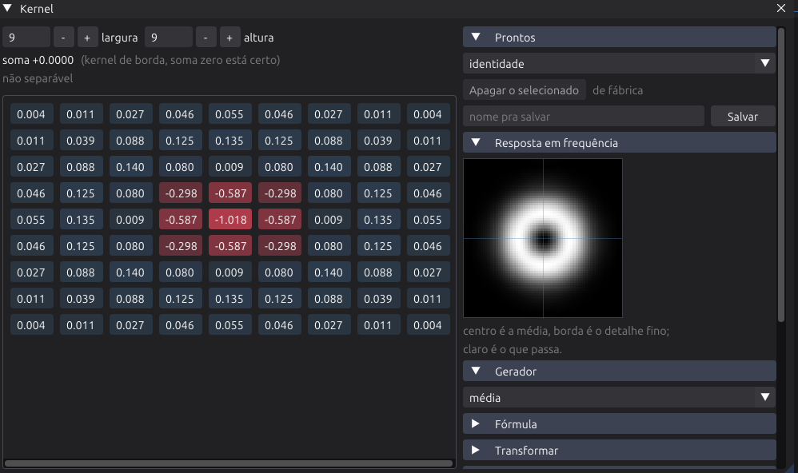
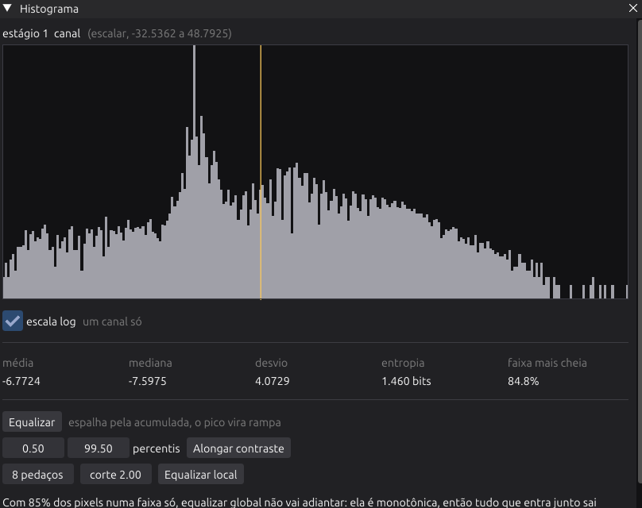

<p align="center"></p>

Bancada de processamento de imagem em C++, escrita do zero, para estudo e
experimentação de algoritmos. Reúne o processamento clássico do livro do
Gonzalez e os algoritmos de segmentação por grafo, IFT e OIFT.



A unidade de trabalho é a **cadeia**: uma lista ordenada de operações onde a
saída de cada estágio fica guardada, inspecionável e cronometrada. Mudar um
parâmetro reavalia a cadeia inteira e mostra o efeito em qualquer ponto dela,
não só no fim.

## Exemplo

Segmentar a flor, cinco estágios:



O canal `a*` do Lab separa magenta de verde num escalar só, o que deixa o
histograma bimodal e o Otsu decide sozinho. A abertura come o respingo, o
preenchimento fecha o miolo escuro, e o filtro de componentes fica com a maior.

Essa cadeia é o arquivo abaixo, e o programa lê e escreve ele:

```
aresta 1
imagem /home/ygg/Pictures/imagem.jpg
vista 6

estagio 1 canal
  de 0
  ativo 1
  espaco lab
  componente 1

estagio 2 limiar
  de 1
  ativo 1
  nivel 0.5
  otsu 1
  unidade fracao
  bits 8
```

## Núcleo

Cor é `float32` em espaço **linear**, RGBA intercalado, com stride pra recorte
sair sem cópia. A conversão de sRGB acontece só nas bordas, na leitura e na ida
pra tela. `Map<T>` é o plano escalar de mesma geometria, um valor por pixel.

Um estágio produz um de três tipos, e é isso que define o que pode ser ligado
em quê:

| tipo | representação | onde aparece |
| --- | --- | --- |
| cor | `Image`, RGBA float32 linear | imagem, composição, overlay |
| escalar | `Map<float>` | gradiente, distância, canal, espectro |
| rótulo | `Map<int32_t>` | binário, componentes, bacias, sementes |

A cadeia é tipada e recusa ligação inválida antes de rodar. Operação
polimórfica (`morfologia`, `girar`, `combinar`) declara o conjunto que aceita e
devolve o que recebeu: morfologia sobre rótulo sai rótulo, sobre escalar sai
escalar. Convolução não entra em rótulo, porque interpolar índice de região não
quer dizer nada.

As ligações são por id, não por posição, então apagar um estágio do meio não
reescreve a referência de todo mundo que vem depois. Reordenar é recusado
quando a troca faria alguém depender de quem vem depois.

## Operações

| grupo | operações |
| --- | --- |
| Tom | exposição, contraste, gama, inverter, curva por fórmula, plano de bit |
| Histograma | equalizar, CLAHE, alongar contraste, casar histograma |
| Vizinhança | convolução, médias (aritmética, geométrica, harmônica, contra-harmônica), filtro de ordem (mediana, mín, máx, ponto médio, alfa-cortada), redução adaptativa, mediana adaptativa |
| Frequência | espectro, filtros ideal/Butterworth/gaussiano em passa-baixa, passa-alta, passa-faixa e rejeita-faixa, degradação por movimento e turbulência, filtro inverso, Wiener e mínimos quadrados restritos |
| Cor | canal em RGB, HSV, HSI, Lab, YCbCr e CMY, composição, gradiente vetorial, distância a uma cor, pseudo-cor |
| Binário | limiar (absoluto, fração ou nível, com Otsu), limiar local (média, gaussiana, Sauvola), multi-Otsu, Canny, zero-crossings do LoG, Hough para retas e círculos, morfologia, hit-or-miss, afinamento, preencher buracos, reconstrução geodésica, componentes conexas, transformada de distância |
| Segmentação | mínimos regionais com h, watershed por marcadores |
| Descrição | contorno reconstruído por descritores de Fourier |
| Geometria | redimensionar, girar, recortar, espelhar, quantizar |
| Entre estágios | combinar (soma, subtração, diferença absoluta, produto, divisão, mín, máx, média), métricas (RMSE, MAE, PSNR, SNR, SSIM), overlay, ruído |

Ruído tem gaussiano, rayleigh, gama, exponencial, uniforme, sal e pimenta e
periódico, com semente fixa pra experimento repetir.

A transformada de distância aceita euclidiana exata (Felzenszwalb e
Huttenlocher, separável) ou chanfro em D4 e D8.

`métricas` compara dois estágios e sai um mapa de onde eles se afastaram, com
os números no resumo. O SSIM é a janela gaussiana 11x11 com sigma 1.5 do artigo
do Wang, e a média ignora a faixa da borda, como no código original. Em cor a
medição sai sobre o valor com gama, que é onde a literatura de PSNR e SSIM
vive; no linear o número não bate com paper nenhum. Confere com o
`scikit-image` em cinco casas.

## Convolução



`Ferramentas > Kernel` edita a matriz coeficiente a coeficiente, carrega um dos
prontos, gera por parâmetro (média, gaussiana, LoG, diferença de gaussianas,
Gabor, disco, borrado de movimento, constante) ou preenche por fórmula, onde `x` e `y` contam do
centro, `r` e `t` são as mesmas coordenadas em polar, e `a`, `b`, `c` ficam em
sliders. `gauss(r, a)` reconstrói a gaussiana, `r <= a` dá um disco.

A janela mostra a soma dos coeficientes, se a matriz é separável (a diferença
entre `w*h` e `w+h` multiplicações por pixel) e a resposta em frequência ao
vivo. Na captura acima, o LoG e o anel passa-faixa que ele é.

O botão `editar` na linha do estágio liga a janela naquele estágio, e daí em
diante mexer num coeficiente é mexer na cadeia. A janela da curva funciona
igual.

Borda em zero, estender, espelhar ou circular. O caminho é escolhido por
tamanho de kernel, e dá pra forçar:

| kernel | espacial | frequência |
| --- | --- | --- |
| 5x5 | 1.1 ms | 14.8 ms |
| 11x11 | 5.4 ms | 13.4 ms |
| 21x21 | 13.4 ms | 13.7 ms |
| 41x41 | 46.3 ms | 15.0 ms |
| 81x81 | 169.1 ms | 14.0 ms |

Medido em 736x414. O custo da FFT não cresce com o kernel, então o corte
automático fica em 25x25.

## Histograma



`Ferramentas > Histograma` mede o estágio que está na tela, não a imagem
original. Em cor mostra R, G, B e luminância, com as faixas contadas em sRGB ou
no valor linear guardado. Escala log por padrão, porque um fundo liso vira um
pico que achata todo o resto contra o eixo.

Junto vêm média, mediana, desvio, entropia e o peso da faixa mais cheia, o
nível do Otsu marcado na curva, e botões que acrescentam estágio na cadeia.

Quando a faixa mais cheia passa de metade dos pixels, a janela avisa: a
equalização global é monotônica, então tudo que entrou junto sai junto. Com 85%
dos pixels numa faixa só, como no `a*` da captura, nenhuma função de um
argumento espalha aquilo. A local escapa disso dando mapeamentos diferentes em
lugares diferentes. O estágio `equalizar` faz o mesmo aviso a partir de um
quarto.

## Watershed

O watershed trabalha direto em tons de cinza. O jeito mais comum de usar é
passar o gradiente da imagem como relevo e gerar os marcadores com o estágio
`mínimos regionais`, sem precisar binarizar nada.

Com `h` em zero, qualquer vale vira marcador, e num gradiente real isso dá um
mínimo pra cada ruído (dezenas de milhares numa imagem de 1024x1024). É o
famoso excesso de segmentação do watershed. O `h` resolve isso: vales com menos
de `h` de profundidade são aterrados antes da busca. Nessa mesma imagem, `h` em
10% já reduz 56380 mínimos pra 144. Por padrão ele é uma fração da faixa do
relevo, então o mesmo valor funciona tanto num gradiente que vai até 0.2
quanto num canal L de Lab que vai até 100.

A máscara é opcional. Com relevo binarizado vale usar, senão uma bacia escorre
pelo fundo e toma a imagem toda. Com gradiente em tons de cinza, o normal é
deixar sem.

Por baixo é uma IFT com custo fmax: cada pixel fica com o marcador que chega
até ele pelo caminho de crista mais baixa, e em caso de empate ganha quem
chegou primeiro. A linha divisória sai com um pixel de largura.

O resultado bate pixel a pixel com o `segmentation.watershed` do
`scikit-image`, com e sem linha e com e sem máscara. Os mínimos regionais
batem com o `local_minima`. No `h`, a convenção é a do mínimo estendido (o
`imextendedmin` do MATLAB), que marca o platô inteiro de cada vale. O
`h_minima` do `scikit-image` marca só o fundo, mas os vales que sobram são os
mesmos. Tem uma diferença de desempenho: com linha divisória e muitos
marcadores o `scikit-image` trava, porque coloca o mesmo pixel na fila várias
vezes. Aqui cada pixel entra uma vez só, e 1024x1024 com 56 mil marcadores
roda em meio segundo.

## Componentes e descritores

`Ferramentas > Componentes` lista as regiões de um estágio, filtra por área,
isola um rótulo e mede cada região. Ligando `descritores`, aparecem caixa,
centroide, perímetro, circularidade, extensão, solidez, eixos da elipse
equivalente, orientação, excentricidade e os sete momentos de Hu. Dá pra
copiar ou salvar tudo em CSV.

Alguns detalhes que mudam os números:

- O perímetro sai do código de cadeia, com passo reto valendo 1 e diagonal
  valendo raiz de 2. Contar pixels de borda superestima.
- A fronteira é traçada pelo seguimento de Moore, que só para quando repete o
  primeiro passo (critério de Jacob). Parar ao voltar ao pixel inicial falha
  em regiões com istmo de um pixel.
- O casco convexo usa os cantos dos pixels, não os centros. Assim um
  retângulo tem solidez exatamente 1 e um disco digital dá 0.968. O
  `scikit-image` usa os centros e chega em 0.98.
- Em regiões muito pequenas a circularidade passa de 1, porque o perímetro
  digital fica curto demais. A tabela mostra esses casos em amarelo.

Área, centroide, eixos, excentricidade, orientação e Hu batem com o
`regionprops` do `scikit-image`. Os momentos de Hu batem em dez dígitos.

### Descritores de Fourier

A fronteira é tratada como uma sequência de números complexos `x + jy`, e a
DFT dela dá os coeficientes `a(u)`. No CSV entram oito valores por região:
`|a(u)| / |a(1)|` pra `u` em -1, 2, -2, 3, -3, 4, -4 e 5. Normalizados assim,
eles não mudam com posição, escala, rotação nem com o ponto onde a volta
começa. O primeiro vale zero num círculo e cresce à medida que a forma
alonga. Num quadrado, o de `u = -3` dá 1/9, o valor teórico.

Antes da DFT a fronteira é reamostrada em passos iguais de comprimento. Sem
isso, os passos diagonais do Moore deixam a amostragem irregular, e a mesma
elipse girada 37 graus muda o descritor em 0.045. Com a reamostragem, a
diferença cai pra 0.003.

O estágio `contorno de Fourier` redesenha cada região usando só os P
coeficientes de frequência mais baixa. Com 2 sobra um círculo, por volta de 20
a forma já dá pra reconhecer, e com todos o contorno volta igual ao original.
Aqui a fronteira não é reamostrada, pra reconstrução completa ser exata.

A fronteira sai igual à do `findContours` do OpenCV, ponto a ponto e na mesma
ordem. Os coeficientes batem com o `numpy.fft`, e o contorno redesenhado bate
pixel a pixel com a mesma conta feita em `numpy`.

## Curva

`Ferramentas > Curva` é a família de transformação de intensidade: negativo,
log, gama, alongamento linear, fatiamento, solarização. Todas saem da mesma
fórmula em `v`, com o gráfico desenhado por cima do histograma da entrada.

Isso não cabe num kernel: convolução é linear, então multiplica e soma, mas não
eleva a potência nem corta faixa.

## Projeto

`Ctrl+S` salva um `.aresta`: a cadeia inteira, o caminho da imagem e o estado
da vista. É texto, uma linha por campo, pra dar pra ler num editor e comparar
duas versões no diff.

As chaves são sem acento, porque vivem no arquivo e não mudam junto com o texto
da interface. As enumerações vão por extenso (`borda zero`, não `borda 0`),
senão inserir um valor no meio de um `enum` quebraria projeto antigo em
silêncio. Campo ausente fica no padrão, então projeto velho continua abrindo
depois que uma operação ganha parâmetro.

Se a imagem não estiver mais no lugar, o projeto abre do mesmo jeito e o
programa pergunta qual imagem anexar. A cadeia é o trabalho; o arquivo de
entrada é só onde ela apontava.

Vários arquivos abrem ao mesmo tempo, em abas, cada um com sua imagem, sua
cadeia e seu projeto. `trocar` em propriedades roda a mesma cadeia noutra
imagem, que é o jeito de comparar duas entradas no mesmo pipeline.
`./aresta projeto.aresta outra.png` faz isso direto da linha de comando.

## Exportar

`Arquivo > Exportar como` (Ctrl+E) pergunta qual estágio salvar, não só o que
está na tela, e se você quer **como aparece** (RGBA de 8 bits, com colormap,
pra figura) ou os **valores crus** (o número que o estágio carrega, sem
colormap e sem cortar).

| formato | guarda |
| --- | --- |
| PNG, JPEG, BMP, TGA | o que aparece |
| PFM | float32 exato |
| Netpbm | PGM de 16 bits |
| CSV | nove dígitos |
| NPY | abre no `numpy.load` |

`Arquivo > Exportar pipeline` monta uma folha com os estágios que você marcar,
lado a lado e com legenda embaixo de cada um, que é a figura que este README
usa logo no começo. Colunas, largura do quadro, espaço, margem e filete se
ajustam, e a prévia é a própria folha.

O fundo vai transparente, branco, claro ou escuro. O transparente sai em PNG
com alfa de verdade, pra cair num documento que já tem cor própria. Encolher
quadro usa média de área, não bilinear, que pula pixel e serrilha justo numa
figura que vai pra artigo.

## Build

Precisa de um compilador com C++20, CMake, Ninja e SDL2:

```bash
sudo apt install build-essential cmake ninja-build libsdl2-dev libgl-dev
./build.sh Release
./aresta imagem.png
```

`./build.sh` sem argumento faz Debug. O script deixa um link simbólico `aresta`
na raiz apontando pro binário em `build/bin`.

Arquivo entra por argumento, arrastado na janela ou pelo menu. Arrastar em cima
de algo já aberto abre outra aba.

## Stack

C++20 no núcleo, SDL2 pra janela e input, Dear ImGui pra interface, OpenGL 3.3
pra desenhar, stb_image pra ler arquivo. CMake e Ninja no build.

## Estado

Feito:

- [x] buffer float32 linear, `Map<T>`, operações por pixel
- [x] cadeia tipada, com a saída de cada estágio inspecionável e cronometrada
- [x] convolução, com editor de kernel, geradores, fórmula e caminho por FFT
- [x] transformação de intensidade por fórmula, com o gráfico da curva
- [x] histograma, equalização global e local, alongamento e Otsu
- [x] filtros de ordem, casamento de histograma, planos de bit
- [x] FFT 2D, espectro centralizado e filtros no domínio da frequência
- [x] modelos de ruído com semente fixa, filtros de média e adaptativos
- [x] degradação, filtro inverso, Wiener e mínimos quadrados restritos
- [x] HSV, HSI, Lab, YCbCr e CMY, gradiente de cor e pseudo-cor
- [x] vizinhança por raio, morfologia e componentes, com filtro por área
- [x] distância exata e por chanfro, reconstrução geodésica, esqueleto,
      hit-or-miss
- [x] Canny, zero-crossings do LoG, limiar local e multi-Otsu
- [x] Hough para retas e círculos, e watershed por marcadores
- [x] watershed em tom contínuo, com mínimos regionais e h-mínimos de marcador
- [x] redimensionar, girar, recortar, espelhar e quantizar, com interpolação
- [x] aritmética entre estágios, fios da cadeia desenhados, exibição fixável
- [x] mapa escalar e de rótulo na tela, com colormap
- [x] exportar estágio: PNG, JPEG, BMP, TGA, Netpbm, PFM, CSV, NPY
- [x] salvar e carregar projeto, com vários abertos em abas
- [x] exportar o pipeline como figura, com legenda e fundo transparente
- [x] métricas de erro entre estágios: RMSE, MAE, PSNR, SNR e SSIM
- [x] descritores de região: fronteira, código de cadeia, casco convexo,
      momentos de Hu, e o CSV deles
- [x] descritores de Fourier, com o contorno reconstruído por P coeficientes

Falta:

- [ ] textura por co-ocorrência, wavelets, casamento por correlação
- [ ] pincel de semente, IFT e OIFT sobre a imagem
- [ ] bancada de grafo: montar, desenhar, rodar algoritmo e exportar
- [ ] modo bench: rodar sobre dataset, cronometrar, medir

Desenvolvido no Ubuntu 24.04.
